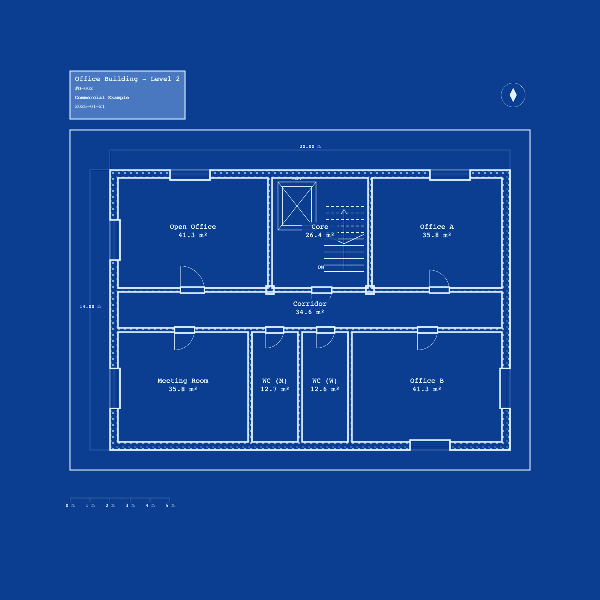
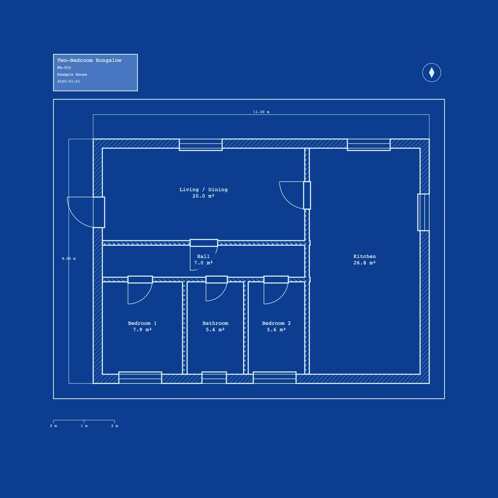

# parti-mcp v2

An MCP server that renders architectural floor plans and site plans as SVG in a blueprint aesthetic, following real architectural drawing conventions. Built with precision planar geometry (Clipper WASM + flatten-js).

| Office floor plan (`office.json`) | Residential floor plan (`house.json`) |
| :---: | :---: |
|  |  |

Both images are rendered directly by the server from the specs in [`examples/`](examples/) — walls with cut poché, door swing symbols, room labels with computed areas, an elevator shaft and stair with UP/DN, dimensions, a title block, north arrow, and scale bar.

## Features

- **Precision geometry engine**: Uses Clipper (js-angusj-clipper) for robust planar geometry operations with integer-precision scaling
- **Analytical primitives**: flatten-js for centroids, point-along-path, perpendiculars, and arc geometry
- **Architectural rendering**: Proper wall junctions (offset→union→cut→stroke), door/window symbols, room labels with area calculations
- **Vertical circulation & structure**: Stairs (tread lines + UP/DN arrow + break line), ladders, elevators (shaft symbol), columns/piers with material poché
- **Wall vocabulary**: Straight or circular-arc (curved) walls, full-height or low (half/pony/knee) walls, and mixed materials on a single floor (rendered per material group)
- **Legible labels**: Room and site labels render on a background "safe area" halo so busy hatching never bleeds through the text
- **Multi-theme output**: Blueprint (dark) and Whiteprint (light) themes with theme-aware text contrast
- **Multi-scale support**: Automatic scaling from paper millimeters to model units (1:100, 1:50, 1:200, etc.)
- **Multi-floor plans**: Render each floor separately or batch process buildings
- **Site and city plans**: Buildings, parcels, roads, green spaces, water features, barriers, trees, and paved areas

## Architecture

### Core Geometry Pipeline

1. **Input**: FloorPlanSpec or SiteSpec (Zod-validated schemas)
2. **Geometry Processing**:
   - Wall/road polylines are offset to solid bands (Clipper)
   - Overlapping bands are unioned (Clipper with NonZero fill rule)
   - Junctions are cleaned via offset→union→cut workflow
   - Interior polygons (rooms/parcels) are extracted
3. **Rendering**:
   - Walls/roads/outlines rendered as stroked paths (no fill)
   - Rooms/buildings rendered as filled polygons with hatch patterns
   - Openings (doors/windows) cut from walls or drawn as symbols
   - Text labels positioned at centroids with automatic contrast detection
   - Title blocks, scale bars, and north arrows added per AIA conventions
4. **Output**: SVG with embedded patterns, markers, and defs

### Key Files

- **src/geometry/clipper.ts**: Clipper WASM wrapper, offset, union, difference operations
- **src/geometry/primitives.ts**: flatten-js wrappers for centroids, perpendiculars, point-along-path, polygon area
- **src/geometry/scale.ts**: paper-mm ↔ model-unit conversion, dimension text formatting, scale-bar tick stops
- **src/render/theme.ts**: blueprint/whiteprint palettes, lineweight/linetype resolution, contrast-aware text color
- **src/render/titleblock.ts**: Title block generation with scaled text and backgrounds
- **src/render/symbols.ts**: Door swing, window glazing, grid bubbles, dimension strings, scale bars, north arrows
- **src/render/sheet.ts**: Sheet assembly — border, title block, north arrow, scale bar around the drawing content
- **src/tools/renderFloorPlan.ts**: Floor plan rendering pipeline
- **src/tools/renderSitePlan.ts**: Site plan rendering pipeline

## Getting Started

### Use it as an MCP server

parti-mcp is a stdio MCP server: an MCP client (Kiro, Claude Desktop, etc.) launches it and calls its tools. You don't run it by hand — you point your client's config at a command that starts it.

**Run directly from GitHub (no clone, no install step):**

```json
{
  "mcpServers": {
    "parti-mcp": {
      "command": "npx",
      "args": ["-y", "github:Hbler/parti-mcp"]
    }
  }
}
```

**Or, once published to npm:**

```json
{
  "mcpServers": {
    "parti-mcp": {
      "command": "npx",
      "args": ["-y", "parti-mcp"]
    }
  }
}
```

Either way the client spawns the server, which exposes three tools: `render_floor_plan`, `render_site_plan`, and `ping`. The server advertises the full JSON Schema for each spec plus a usage brief in its MCP `initialize` response, so the calling model knows every field.

> The package builds itself on install (a `prepare` step compiles TypeScript to `dist/`), and the compiled entry runs on plain Node — no global `tsx` needed on the consumer's machine.

### Develop from source

```bash
git clone https://github.com/Hbler/parti-mcp
cd parti-mcp
npm install          # also builds dist/ via the prepare step
npm start            # run the server over stdio from TypeScript source (tsx)
npm run build        # type-check and emit dist/
```

To point an MCP client at your working copy instead of the published package:

```json
{
  "mcpServers": {
    "parti-mcp": {
      "command": "npx",
      "args": ["tsx", "/absolute/path/to/parti-mcp/src/index.ts"]
    }
  }
}
```

### Running Tests

```bash
npm test
```

Covers:
- Geometry operations (clipping, offsetting, unions)
- Schema validation
- Rendering pipeline
- Integration tests with real examples
- Regression tests for known bugs (junction seams, text sizing, enclosed-room poché)

### Rendering examples without a client

To render the bundled examples directly (writes SVGs to `smoke-output/`):

```bash
node --import=tsx scripts/smoke-test.mjs
```

Or call a tool handler from your own script. Import the `.ts` sources with `tsx` when running from a source checkout, or the built `dist/*.js` when running against a compiled install:

```typescript
import { initializeClipper } from "./src/geometry/clipper.ts";
import { handleRenderFloorPlan } from "./src/tools/renderFloorPlan.ts";
import fs from "node:fs";

await initializeClipper(); // required once before any render
const spec = JSON.parse(fs.readFileSync("examples/house.json", "utf-8"));
const result = await handleRenderFloorPlan({ spec });
console.log(result.content[0].text); // SVG output (one entry per floor)
```

## Example Specifications

### Floor Plan (house.json)

Single-floor residential plan:
- 15m × 10m footprint
- 2 rooms (living room, kitchen)
- Interior partition wall
- Exterior doors/windows
- Dimension annotations

```json
{
  "unit": "m",
  "scale": "1:50",
  "theme": "blueprint",
  "titleBlock": { /* ... */ },
  "floors": [
    {
      "id": "ground-floor",
      "level": 0,
      "outline": [[0, 0], [15, 0], [15, 10], [0, 10]],
      "walls": [ /* paths with thickness */ ],
      "rooms": [ /* polygons with labels */ ],
      "openings": [ /* doors and windows */ ],
      "dimensions": [ /* annotation lines */ ]
    }
  ]
}
```

### Multi-Floor (two-floor.json)

Two-story residential:
- Ground floor: Living Room, Kitchen/Dining, Entry Hall, WC
- First floor: bedrooms, bathroom, landing
- A stacked stair (UP on the ground floor, DN on the first) positioned clear of door swings
- Columns placed on the structural grid
- Interior partitions on both levels

### Detailed House (house-detailed.json)

Exercises the fuller vocabulary: a low (knee) wall, stairs running to an upper level, and a loft-access ladder.

### Curved Wall (curved-wall.json)

Minimal demo of a curved wall (a shallow bay window authored as a two-point wall with `curve`) and a round column.

### Office Building — Level 2 (office.json)

Commercial floor plate: an elevator + stair core (single lobby, one corridor door), a central corridor, two restrooms opening onto the corridor, open-plan and cellular offices, and columns on grid.

### City / Figure-Ground (city.json)

Urban site plan at 1:500: labeled building footprints, a street grid, and a park plaza.

### Whiteprint (house-whiteprint.json)

The bungalow rendered in the light (whiteprint) theme, with one highlighted room demonstrating per-element `style.fill`.

### Site Plan (site-plan.json)

Residential site with:
- Main building footprint
- Property parcel boundary
- Street frontage
- Driveway (asphalt)
- Sidewalk (concrete)
- Pool (water feature)
- Landscaping (lawn, garden)
- Property fence
- Site trees with species

```json
{
  "unit": "m",
  "scale": "1:100",
  "buildings": [ /* footprints with labels */ ],
  "roads": [ /* paths with width */ ],
  "pavedAreas": [ /* polygons with surface type */ ],
  "greenSpaces": [ /* polygons with landscape type */ ],
  "water": [ /* polygons with water type */ ],
  "barriers": [ /* paths with barrier type */ ],
  "trees": [ /* positions with radius and species */ ]
}
```

## CLI Tools

### renderFloorPlan

Renders architectural floor plans with proper junction handling and legend.

```typescript
export async function handleRenderFloorPlan(input: {
  spec: FloorPlanSpec;
  outputPath?: string;
}): Promise<ToolResult>;
```

**Input Schema** (FloorPlanSpec):
- `unit`: "m" | "ft" | "mm"
- `scale`: "1:50" | "1:100" | "1:200" (etc.)
- `theme`: "blueprint" | "whiteprint"
- `titleBlock`: Optional title block metadata
- `floors[]`: Array of floor specs, each with:
  - `outline`: Boundary polygon
  - `walls[]`: Wall centerlines with `thickness` and optional `material` (mixed materials on one floor render per group). Optional `heightClass`: `"full"` (default, solid cut poché) or `"low"` (half/pony/knee wall or railing below the cut plane → dashed outline, no fill). A wall may curve: give a two-point `path` plus `curve: { radius, clockwise }` and the server tessellates a circular arc that unions/cuts like a straight wall.
  - `rooms[]`: Room polygons with type, optional custom fill, optional `label` (name; area is still appended) and `labelOrientation` (`horizontal` | `vertical`). Labels render on a legibility halo
  - `openings[]`: Doors/windows referencing a wall by `wallId` at `positionAlongWall` in [0,1]; doors need `hinge` (start|end) + `swingSide` (left|right)
  - `stairs[]`: Straight-run stairs — `footprint`, `run` [bottom, top] travel centerline, `treads` count, `direction` (up|down)
  - `ladders[]`: `path` [start, end] + `width` (rails + rungs)
  - `elevators[]`: `footprint` (shaft rectangle) + optional `label` (X-in-box shaft with inset car)
  - `columns[]`: `position`, `shape` (square|rectangular|round), `size` or `width`+`depth`, optional `material` (poché footprint — place on grid intersections)
  - `dimensions[]`: Annotation lines with text
  - `grid`: Optional structural grid (labeled bubbles)

**Output**: SVG at `outputPath` or returned as text

### renderSitePlan

Renders site plans with buildings, roads, landscape, and utilities.

```typescript
export async function handleRenderSitePlan(input: {
  spec: SiteSpec;
  outputPath?: string;
}): Promise<ToolResult>;
```

**Input Schema** (SiteSpec):
- `buildings[]`: Building footprints with `label` and optional `labelOrientation` (`horizontal` | `vertical`)
- `roads[]`: Road polylines with width
- `pavedAreas[]`: Paved polygons (driveways, parking, sidewalks, patios, decks). Optional `elevated: true` renders the area **above** water (for a deck/boardwalk/jetty over a pond or pool); optional `label` overrides the surface-derived name, `labelOrientation` rotates it
- `greenSpaces[]`: Landscape polygons (lawn, garden, trees); optional `label`/`labelOrientation`
- `water[]`: Water features (pools, ponds); optional `label`/`labelOrientation`
- `barriers[]`: Fences, walls, hedges
- `trees[]`: Individual tree positions with radius and species

**Labels**: on area entities (buildings, rooms, paved areas, water, green spaces), `label` overrides the auto-derived name (a room still appends its computed area); `labelOrientation: "vertical"` rotates the label 90° (reading bottom-to-top) so it fits a narrow shape; `labelPosition` places the label within the area — `center` (default) or one of eight bounding-box positions (`top-left`, `top`, `top-right`, `left`, `right`, `bottom-left`, `bottom`, `bottom-right`). Corner positions anchor the text to the corner, reading inward.

## Scale and Units

All coordinates are in **model units** (meters, feet, mm depending on spec).

**Scale conversion** is automatic:
- Input scale string (e.g., "1:100") is parsed
- SVG font sizes and line widths are scaled appropriately
- At 1:100 with meters, 0.1 model units = 1cm on paper
- Text is rendered proportional to drawing size (0.5–3% of bbox height)

**Unit handling**:
- All internal calculations use model units
- Title blocks, scale bars adapt to unit and scale

## Theme System

### Blueprint (default)
- Background: Prussian blue (`#0B3D91`)
- Ink: Pale cyan (`#E0F2FF`)
- Poché fill: Darker blue (`#1A4BA8`)

### Whiteprint (opt-in)
- Background: White (`#FFFFFF`)
- Ink: Black (`#000000`)
- Poché fill: Light gray (`#D3D3D3`)

### Per-element fill and label contrast
Any drawable entity may set `style.fill` to highlight it in a specific color, regardless of theme. Room and site labels render on a background "safe area" halo (a card behind the text) so that dense floor/site hatching never renders through the label. On top of the halo, `getContrastingTextColor` picks whichever of the theme's `ink` or `background` color has the greater luminance distance from the room's actual fill, so a label stays legible whether the room uses the theme default or a custom highlight color, in either theme.

## Technical Details

### Geometry Operations

**Offsetting Walls to Bands**:
```
Path (centerline) + thickness → Solid band polygon
```

**Junction Handling** (offset→union→cut→stroke), the core fix that makes connected walls/roads read as one drawing instead of overlapping outlines:
```
1. Offset every wall/road centerline in a floor/site to its own solid band (OpenButt end type)
2. Union all bands into one merged polygon (NonZero fill rule — EvenOdd would
   treat the genuinely-overlapping area at a junction as a hole and split
   the result back into separate pieces)
3. Difference the door/window opening cutters from that merged polygon
4. Stroke the single resulting boundary once — never per-wall
```

Walls are grouped by `material` and each group runs through this pipeline independently, so a floor can mix materials (each hatched on its own). Each group's cut poché is emitted as a **single `fill-rule="evenodd"` path**: when interior walls form a connected loop, the union returns the enclosed room void as a separate opposite-winding subpath, and even-odd makes that void a *hole* rather than a filled polygon — otherwise the room interior would be flooded with the wall hatch.

**Rooms are author-supplied, not derived.** A `Room.polygon` is authored directly in the spec to the room's interior wall face — it is not extracted or computed from the wall geometry. This keeps the computed area (`getPolygonArea`) honest as usable floor area, and means room fill always meets wall poché with no gap as long as the spec author places the room polygon at the wall's inner face. Label position is the room polygon's centroid (`getCentroid`).

### Text Rendering

All text sizing is computed as:
```
fontSize (model units) = textSizeInPaperMm * modelPerPaperMm(scale, unit)
modelPerPaperMm = scaleDenominator / mmPerUnit
```

For scale "1:100" with unit "m" (1 m = 1000 mm):
- modelPerPaperMm = 100 / 1000 = 0.1
- 1.5mm text → 1.5 * 0.1 = 0.15 model units (15 cm — reads correctly on a drawing sized in metres at 1:100)

This same conversion drives every line weight, tick size, and bubble radius — nothing is a hardcoded pixel/model-unit constant, so output reads correctly whether the spec is a metre-scale floor plan or a much larger site plan.

Text is rendered with `font-family="monospace"` for deterministic sizing.

### Patterns and Hatches

Hatches are defined as SVG `<pattern>` elements (`patternUnits="userSpaceOnUse"`, so density stays scale-correct and continuous across adjacent shapes) in `<defs>` and referenced via `fill="url(#hatch-type)"`:
- `hatch-brick`: 45° diagonal lines
- `hatch-masonry`: 45° diagonal lines, coarser than brick
- `hatch-concrete`: Stipple/dot pattern
- `hatch-insulation`: Batting pattern
- `hatch-wood`: Parallel plank lines (backs the `wood` material and `deck` surface)
- `hatch-lawn`: Scattered circles for grass
- `hatch-pavers`: Grid pattern for paved areas
- `hatch-earth`: Dense 45° lines for soil

## Known Limitations

- All polylines are treated as open paths; closed loops require explicit endpoint
- Text is positioned at geometric center; complex labels may benefit from manual adjustment
- Curved walls are supported as **circular arcs only** (a two-point path plus `curve: { radius, clockwise }`, tessellated before offsetting); non-circular curves (splines, ellipses) are not supported
- Plans are a single 2D horizontal cut — there is no continuous vertical model. Furniture/fixtures and MEP are out of scope
- High-precision geometry relies on integer arithmetic; very large drawings may lose precision

## Contributing

All code follows TypeScript strict mode. Changes must:
1. Pass `npm run build` (TypeScript check)
2. Pass `npm test` (full test suite)
3. Update relevant tests if schemas or rendering change
4. For new examples, render to `output/examples/` and visually verify (e.g. rasterize with `qlmanage -t -s 1600 -o <dir> output/examples/*.svg`)

## License

MIT — see [LICENSE](LICENSE).

## Version History

v2 is a full rebuild of an earlier Turf.js-based prototype: a different geometry engine (Clipper + flatten-js, replacing Turf's geospatial/spherical math, which was the root cause of a geometry bug at wall/road junctions) and a renderer that follows real architectural drawing conventions (blueprint aesthetic, real units + named scale, line-weight hierarchy, poché/material hatching, dimensioning, structural grid, title block, north arrow, scale bar) rather than a generic vector diagram. See `docs/REASONS-CANVAS.md` for the full design history.
